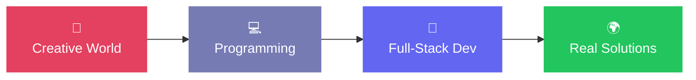

---

## 🧭 Tentang Saya

Saya developer full-stack dari **Kota Blitar, Jawa Timur** 🇮🇩 dengan latar belakang unik di dunia **kreatif** — desain grafis, motion graphics, videografi, dan fotografi.

Latar itu membentuk filosofi saya dalam membangun software:

> *"Software yang baik bukan hanya berjalan — tapi juga mudah dipahami, bermanfaat, dan nyaman digunakan."*

Perjalanan coding saya dimulai sejak bangku SMK (TKJ), dan kini saya membangun aplikasi yang **benar-benar dipakai** oleh sekolah dan organisasi.

- 🔭 Sedang bangun: **E-Learning TKJ** & **MPJ Fest**
- 🌱 Mendalami: backend architecture, deployment & scalability
- 🧠 Fokus: perpaduan *design thinking* + *software engineering*
- 📍 Blitar, East Java, Indonesia

 

---

## ⚡ Tech Stack

**Backend & Database**

**Frontend**

**Tools & Kreatif**

---

## 🚀 Proyek Unggulan

<table>
  <tr>
    <td width="50%" valign="top">
      <h3>🎓 E-Learning TKJ</h3>
      
  

      
Platform e-learning sekolah: materi, quiz, tugas, penilaian, jadwal ujian multi-sesi & lab, sampai sinkronisasi data siswa. Dipakai secara nyata di sekolah saya.

    </td>
    <td width="50%" valign="top">
      <h3>🕌 MPJ Fest</h3>
      
  

      
Sistem event & perlombaan antar-pesantren se-Jawa Timur: pendaftaran lembaga, kelola peserta, penilaian, dan administrasi event.

    </td>
  </tr>
  <tr>
    <td width="50%" valign="top">
      <h3>🖼️ Personal Portfolio</h3>
      
  

      
Website portfolio pribadi yang menampilkan perjalanan, proyek, dan karya digital saya.

    </td>
    <td width="50%" valign="top">
      <h3>💡 More Coming Soon</h3>
      
 

      
Masih banyak ide yang ingin diwujudkan — salah satunya membangun software yang benar-benar menyelesaikan masalah nyata.

    </td>
  </tr>
</table>

---

## 📊 Statistik GitHub

---

## 🐍 Perjalanan Kontribusi

<picture>
  <source media="(prefers-color-scheme: dark)" srcset="https://raw.githubusercontent.com/yunusafr/yunusafr/output/github-contribution-grid-snake-dark.svg" />
  <source media="(prefers-color-scheme: light)" srcset="https://raw.githubusercontent.com/yunusafr/yunusafr/output/github-contribution-grid-snake.svg" />
  
</picture>

---

## 🎯 Nilai yang Saya Pegang

| | | |
|:---:|:---:|:---:|
| 🎨 **Design** Make it beautiful | 🧠 **Engineering** Make it work | 🧩 **Problem** Make it useful |

*Produk terbaik lahir ketika engineering, design, dan empati bekerja bersama.*

---

## 🛤️ Perjalanan Saya

**Kreatif** 🎨 → desain, motion graphics, video, foto
&nbsp;&nbsp;&nbsp;&nbsp;⬇️
**Programming** 💻 → PHP, CodeIgniter, Laravel, React
&nbsp;&nbsp;&nbsp;&nbsp;⬇️
**Full-Stack** 🚀 → membangun solusi nyata 🌍

---

<h3>📫 Mari Terhubung</h3>

  

<i>"Empati, dengarkan, dan tulis kode yang baik."</i> ✨

Terima kasih sudah mampir! — <b>M Yunus Afriza</b> 🚀

